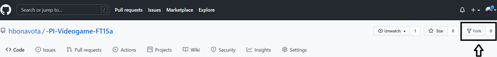
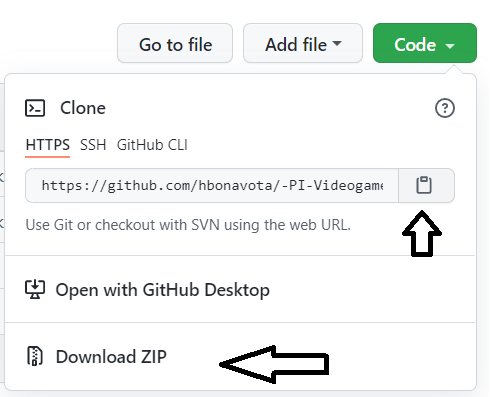
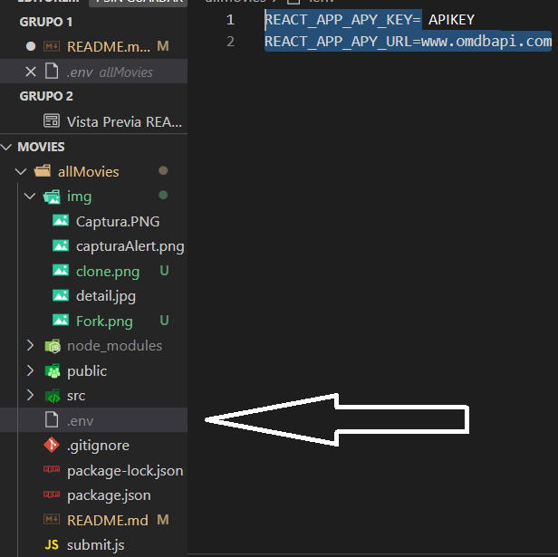
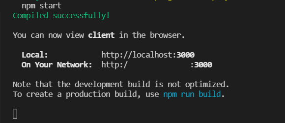
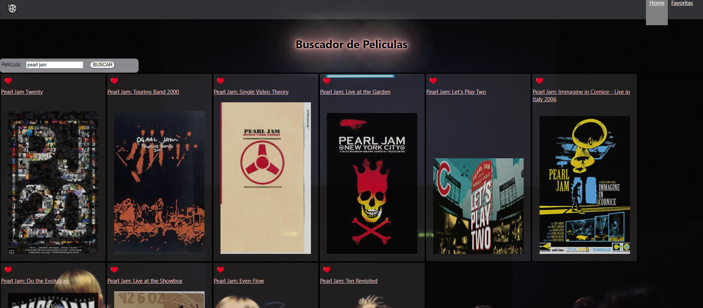
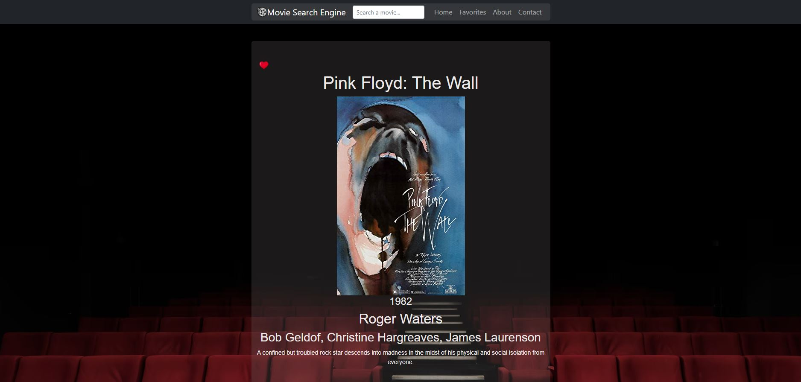
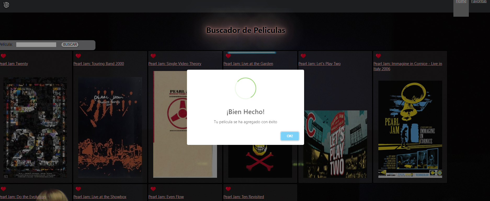

# Individual Project  React-Redux

# Movie search engine
___

<p>"Movie search engine" was the individual project that I had assigned, which consisted of building an App, programming in Javascript and using React, Redux technologies. For styles use pure CSS, since that was the requirement.
</p>

____

# About the proyect
___
<p>
The main objective of the project was that we learn to solve the different problems without using external libraries, and doing it with "react classes", without using the HOOKS that are clearly more functional, but that the scope of the project sought to learn the life of the components in react with Classes like these ->

```
componentDidMount ()
componentDidUpdate ()
componentWillUnmount ()

```
and saving the favorite movies in the
```
window.localStorage
```
in addition to the state Redux.
 </p>

___
# Directions for executing the project


To be able to execute the project correctly, the following indications must be taken into account.
If you have any questions or concerns with the installation you can write to me without problem -> [Here](hbonavota@gmail.com)

___

# Installation


+ Fork the repository


<div align="center"> </div>


+ You can download the zip or clone it on your PC, if you choose to clone it, you simply stop in your folder and with the terminal you clone the repository. Example:

<div align="center"> </div>

```
Git clone https://github.com/hbonavota/All-Movies-React-Redux.git
```  

+ You need the APY KEY(You can get here http://www.omdbapi.com/apikey.aspx) and create environment variables file .env 

```
REACT_APP_APY_KEY=20dac387
REACT_APP_APY_URL=www.omdbapi.com
``` 
In the `/ allMovies` folder like that =>

<div align="center"> </div>

___


# Usage


+ Following the steps up to here, everything should be correct, it would only be necessary to install the dependencies. Finally you have to go to the /allMovies folder and make the `npm install`.

```
/allMovies (main)
npm i

```

+ Finally, run the process with `npm start` 

```
/allMovies (main)
npm start

```
<div align="center"> </div>

___

# Preview


+ HOME
<div align="center"> </div>

+ Movie Detail

<div align="center"> </div>

+ Alert

<div align="center"> </div>


